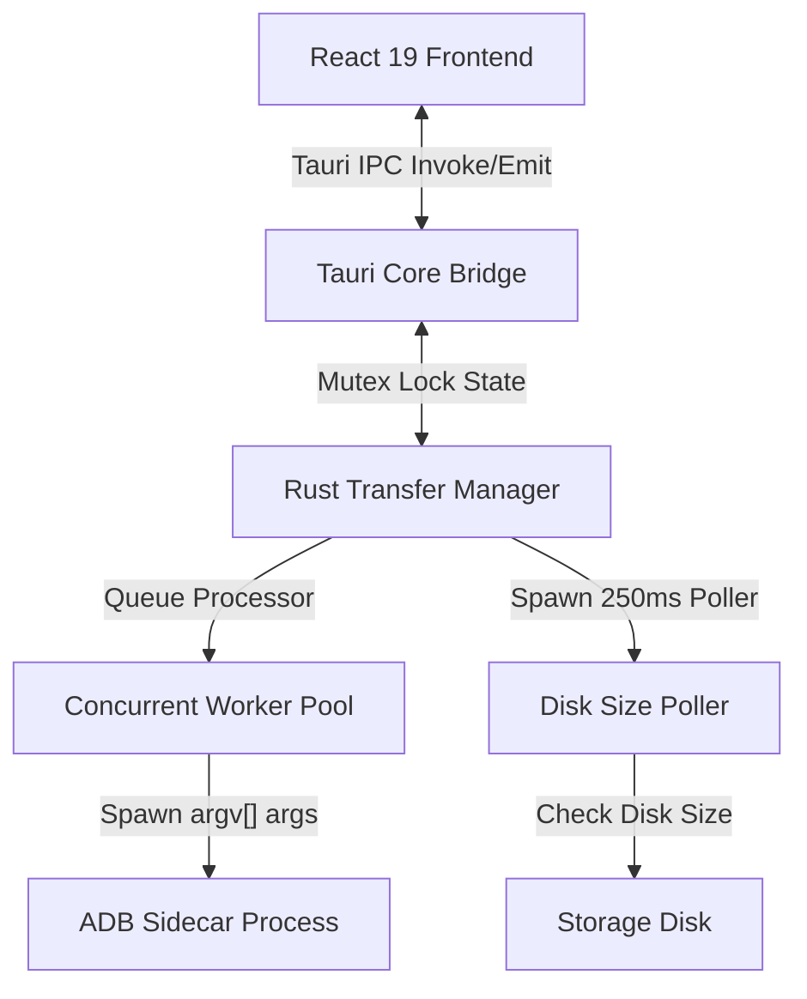

# Madroid

A production-grade, high-performance dual-pane file transfer manager connecting macOS and Android devices using Tauri, Rust, and React. Madroid provides a fluid, responsive interface to browse local storage and Android files side-by-side, supporting multi-selection and real-time transfer tracking.

---

## 🚀 Key Features

*   **Dual-Pane File Explorer:** View local Mac storage and remote Android device filesystem side-by-side with instantaneous directory navigation.
*   **High-Performance Virtualization:** Leverages a custom, native `<VirtualList>` React component designed to render up to 50k directory items smoothly with zero latency or layout reset bugs.
*   **Multi-Selection & Batch Operations:** Support for selection check-boxes and keyboard modifiers (`Cmd`/`Ctrl`/`Shift` + Click) to select multiple files at once. Perform batch transfers (push/pull) and concurrent batch deletes.
*   **Real-Time Disk-Size Polling Progress:** Tracks file transfer progress smoothly by spawning a lightweight background monitor in Rust that polls destination file sizes on disk (`std::fs::metadata` / `adb shell stat`) every 250ms. Displays real-time transfer speed, remaining bytes, and ETA.
*   **Dynamic Device Discovery:** Automatically scans for connected Android devices via USB every 3 seconds, detecting authorization states (RSA debugging prompt) and connection drops.
*   **Wireless Handoff Wizard:** Easy pairing wizard to enable TCP/IP connections on port 5555, allowing users to disconnect their USB cables and continue transferring files wirelessly.
*   **Premium Dark UI:** Sleek, glassmorphism-inspired dark interface using Outfit typography, subtle micro-animations, and real-time slide-up transfer drawers.

---

## 🏗️ System Architecture

The application is structured into a lightweight frontend rendering layer and a secure Rust backend manager:



### 1. Tauri Rust Core Backend
*   **ADB Sidecar Runner (`adb_runner.rs`):** Executes the bundled `adb` binary directly using safe argument vectors (`argv[]`), completely avoiding shell injection risks.
*   **Transfer Manager (`transfer_manager.rs`):** Implements a thread-safe, concurrent task queue that schedules transfers across worker pools (limited to 2 concurrent transfers to protect I/O bandwidth).
*   **Device Discovery (`device_manager.rs`):** Interacts with the local ADB server to poll state parameters and handle connection recovery.
*   **FS Bridge (`fs_trait.rs` / `android_fs.rs`):** Shared filesystem interfaces providing unified command abstractions for directory listing, folder creations, and deletes across POSIX and Android environments.

### 2. React 19 Frontend
*   **Virtual Explorer Component:** Tracks scrolls dynamically and translates elements via CSS translateY matrices, yielding extremely fast rendering times.
*   **Active Queue Drawer:** slide-up drawer subscribing directly to Rust's global progress emitter, displaying active transfers, statistics, and cancellation tokens.

---

## 🛠️ Technology Stack

*   **Frontend:** React 19 (TypeScript), Tailwind CSS, Lucide Icons, Vite
*   **Backend:** Rust, Tauri v2 Framework, Tokio (Async Runtimes), Serde (JSON Marshalling)
*   **Tools:** Android Debug Bridge (ADB Platform-Tools sidecar integration)

---

## 💻 Getting Started

### Prerequisites
*   Node.js (v18+)
*   Rust Compiler (`rustc` & `cargo` via `rustup`)
*   macOS (supports Apple Silicon and Intel architectures)

### Installation & Run

1. Clone the repository and navigate to the directory:
   ```bash
   git clone <repo-url>
   cd MacToAndroid
   ```

2. Install dependencies:
   ```bash
   npm install
   ```

3. Launch the application in development mode:
   ```bash
   npm run tauri dev
   ```

4. Build production installer:
   ```bash
   npm run tauri build
   ```
